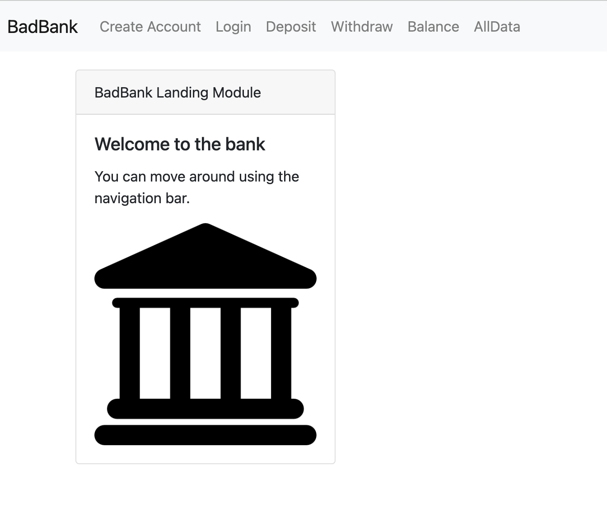

## Project Title
Bad Bank - An exercise in React and MongoDB

## Description
This projects features a banking application on the MERN stack (MongoDB, Express, React, and Node.js), with no security. Users can create an account and make fictional deposits and withdrawls while their balance is recorded. Data is stored in a local MongoDB database and will persist after refresh.

## Installation Guidelines
- Install MongoDB
- Download or `git clone` the repo into a directory of your choice
- Run `npm init`
- Run `node index.js` from the project directory

## Screenshots

## Technology Used
- MongoDB, for the backend database
- Express, for server routing and request/response handling
- React, for front-end components and UI
- Node.js, for the server

## Features
- Bootstrap styling provides navigational system and layout cards
- Stores multiple user accounts and their balances

### Future development
- Error checking and formatting like its [predecessor](https://github.com/tfarnham/bad-bank)
- Authentication and authorization services

## License
MIT
